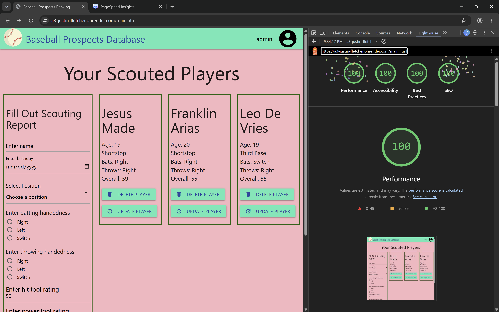

Assignment 3 - Persistence: Two-tier Web Application with Database, Express server, and CSS template
===
# Baseball Prospects Database

[My website](https://a3-justin-fletcher.onrender.com/)

The goal of my application was to allow users to save information about baseball prospects they are doing research on. Users can view their saved players on their account and use the form to enter more players' information. 

I faced many challenges in making this application and spent quite a long time on it. One difficulty I faced was with the redirect functionality. I was able to redirect from the server when the request came in from a form tag, but I was unable to redirect from the server when the request came from a fetch call in my script. My solution to this problem was doing client side redirects using window.location.href to the desired URL. My server told my client to redirect by sending a specific status code of 302. 

I chose a simple authentication strategy of saving my usernames and passwords as plain JSON in my MongoDB database. I made a collection for users separate from my collection of data and tied each data instance in the data collection to a user id. The user id came from MongoDB's automatic assignment of an ID to every new object created. While not very secure, I chose this strategy because it was attainable. Having said that, I think I did a good job since the system does handle incorrect passwords for existing users and non-existing users. The only flaw in the system is if the user types in a non-existent username they get redirected to a create account page at which point they could type in an existing username and there would now be duplicate users in the database. A future improvement could be checking for that obscure edge case and displaying a message along the lines of user already exists. 

My currently created user account are:
> **username:** admin **password:** admin

> **username:** user1 **password:** password123

Both accounts have different data saved with them. If you create a new account it will have no data associated with it.

I used materialize as my CSS framework because I wanted to go with a material design framework and it was the first one I found. I still had to write some CSS and left some of my CSS in from last assignment. I think it might have been better to use a framework like Tailwind which seems to be more powerful. For example, I was having some issues with padding and I had to add CSS rules in my stylesheet to fix it as opposed to setting a custom class name like I believe you can do in tailwind. I also had to add some !important CSS rules to override my framework at times when I didn't like some of the styling choices it made, specifically with font sizes.    

## Technical Achievements
- **100% Lighthouse Scores**: I got 100% in Google Lighthouse's 4 tests on Desktop of Performance, Accessibility, Best Practices, SEO. Below is an image proving that I accomplished this. 
Some steps I took to accomplish this were:
  - Remove my usage of a CDN for my CSS framework and instead serve relevant files from node_modules via my server to increase performance
  - Increase accessibility score by adding some semantic tags, making sure all form inputs have a label, and abiding by contrast guidelines
  - Add meta description tags to improve SEO
  - Note, I sometimes had issues where I got no score for SEO due to issues with the robots.txt file. However, this was only an issue when doing lighthouse in Chrome and eventually resolved itself (as you can see by the image below) If you have this issue, try running the lighthouse test on the web using the website PageSpeed. 

- **Extra Express Middleware Packages**: I used the following extra middleware packages:
  - cors adds extra headers to responses to allow cross-origin requests.
  - morgan adds logging for every incoming request to the server and outgoing response to the client.
  - serve-favicon does what you would expect and serves a favicon icon but it caches it which improves performance
  - compression again is self explanatory in that it compresses responses over 1 kilobyte
  - response-time which records the request response time in milliseconds in a new response header X-Response-Time

### Design/Evaluation Achievements
- **W3C Web Accessibility Tips**: I followed the following tips from the W3C Web Accessibility Initiative:
  - Associate a label with every form control
  - Include alternative text for images
  - Identify page language
  - Use headings and spacing to group related content
  - Provide sufficient contrast between foreground and background
  - Provide informative, unique page titles
  - I believe all of the above required active work on my part. I understand it is not 12 items, but I am still hoping to get partial credit. 
